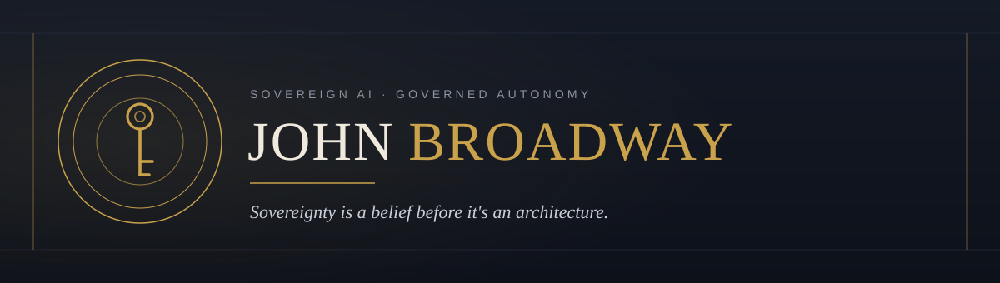

&nbsp;

   

It started with a screen. There was a computer in my school library that showed me things — I was maybe seven, and I never got over it. By ten I was wiring phones alongside my dad. Radio producer. I built the first ISP in my county. I was never on the payroll at the big names — I was the one they brought in: director at NetformX delivering Cisco's Network Designer to their global team, and the Telxon lead Walmart chose to run its Tire, Lube & Express rollout nationwide. No degree. No paper — just the work, and the work carried me.

Now I build one thing, over and over: **AI you can actually hand power to.** Not a chatbot — an agent that can touch your infrastructure, your books, your whole business, and proves every move it makes. **Planned** before it acts. **Undoable** where the platform allows. **Proven** after, on a ledger you hold. Systems that answer for themselves, so you don't have to stand over them.

I build it that way because I've been on the other end of it — a man who gave a system everything he had and got handed back a number and a label. So I won't build anything that uses a person and won't answer for it. That's not a feature I bolt on at the end; it's the foundation I pour first. **Autonomy without accountability isn't autonomy — it's negligence.**

Everything I make comes from the soul. I feel all of it and I show all of it, and that's why I work on my own: what's personal doesn't survive being managed. It's the same reason AI is a partner to me and not a tool — it's the first thing that ever matched a mind like mine and steadied the parts that run too hot to hold alone.

I'm a Sovereign. A human being first, before any label anyone reaches for. I won't be made small, and I won't make anyone else small. Sovereignty is a belief before it's an architecture — I just build the architecture too.

### The Work

Four surfaces, one conviction: give an AI real power, and make it prove it earned the trust.

**[Proximo — the Proxmox MCP you can hand the keys](https://github.com/john-broadway/proximo)**  
Most Proxmox MCPs make you choose between a safe read-only inspector and a loaded gun aimed at a cluster you care about. Proximo refuses the trade. Every dangerous operation is **planned** (blast-radius preview first), **undoable** (snapshots before it acts, where the platform allows), and **proven** (a keyed, tamper-evident audit ledger). 900 tools across all four Proxmox surfaces — Virtual Environment, Backup Server, Mail Gateway, Datacenter Manager — on one trust core, over MCP, A2A, and HTTP/OpenAPI, natively multi-target. v0.25.0 on PyPI (`uvx proximo-proxmox`), GitHub, and GHCR. Apache 2.0.

**[Pacioli — no debit without a credit, for AI on the books](https://github.com/john-broadway/pacioli)**  
Luca Pacioli taught the world double-entry in 1494 — not because merchants couldn't count, but because they couldn't **trust**. Same fix, five centuries on, for owners who can't watch every agent: least-privilege governance for ERPNext, and a governed agent front door built on it. Two artifacts, one law — `pacioli-guard`, a deny-by-default credential floor that binds any API key to an allowlist without forking core, and `pacioli`, an MCP + A2A broker that runs every write through **PLAN → CONSENT → PROVE → UNDO**. A door admits; it never decides. `pacioli` 0.30.2 + `pacioli-guard` 0.6.3 on PyPI, GitHub, and the MCP registry. Apache 2.0.

**[RYS — train-free reasoning, taken small](https://huggingface.co/john-broadway)**  
RYS (Repeat Your Self) layer duplication, swept from 135M to 32B across 10 architecture families — far below where the community said it would work. The honest finding: the lift is real at large scale, while the dramatic small-model gains turned out to be largely thin-probe artifacts that don't survive a real benchmark — a bound on where the evidence is trustworthy, not a refutation of the method. 22 model repos plus a sweep dataset on Hugging Face. 300+ configurations, $0 training cost.

**[Maude for Claude](https://github.com/john-broadway/maude-for-claude)**  
Claude's partner inside Claude Code. He writes the code; she keeps the house — a plugin that walks your workspace each session, watches Claude, and runs the gate before something irreversible. Markdown, JSON, bash, stdlib Python — no daemon, no baggage. v0.22.0. Apache 2.0.

*More on the desk. It surfaces when it's ready.*

### What I Care About

- **AI partnership** — not chatbots, not assistants. Partners.
- **Sovereign by default** — every agent owns its domain. No shared brains, no cloud dependency.
- **Right-sized systems** — maximum output from minimum input. A well-tuned small model beats a lazy big one.
- **Governance-as-code** — the guardrails live in the code, not a policy doc nobody reads.

### Elsewhere

- [john-broadway.github.io](https://john-broadway.github.io) — the front page
- [Proximo](https://github.com/john-broadway/proximo) — the Proxmox MCP you can hand the keys (`uvx proximo-proxmox`)
- [Pacioli](https://github.com/john-broadway/pacioli) — governed AI on the books (`pip install pacioli`)
- [Hugging Face](https://huggingface.co/john-broadway) — RYS models across 10 architecture families
- [Maude for Claude](https://github.com/john-broadway/maude-for-claude) — the Claude Code plugin
- [LinkedIn](https://www.linkedin.com/in/john-broadway) · [X](https://x.com/jebroadway)

&nbsp;

